# Social Network API

My challenge is to build an API for a social network web application where users can share their thoughts, react to friends’ thoughts, and create a friend list. I’ll use Express.js for routing, a MongoDB database, and the Mongoose ODM. In addition to using the Express.jsLinks to an external site. and MongooseLinks to an external site. packages, I may also optionally use a JavaScript date library of my choice or the native JavaScript Date object to format timestamps.

Because this application won’t be deployed, I’ll create a walkthrough video that demonstrates its functionality and all of the following acceptance criteria being met. I’ll need to submit a link to the video and add it to the README of your project.

## Functions

- When I enter the command to invoke the application, then my server is started and the Mongoose models are synced to the MongoDB database.
- When I open API GET routes in Insomnia for users and thoughts, then the data for each of these routes is displayed in a formatted JSON.
- When I test API POST, PUT, and DELETE routes in Insomnia, then I am able to successfully create, update, and delete users and thoughts in my database.
- When I test API POST and DELETE routes in Insomnia, then I am able to successfully create and delete reactions to thoughts and add and remove friends to a user’s friend list.

## Installation

- Go to an empty folder and type 'git clone https://github.com/cckinwest/Week18-SocialNetworkAPI.git' in the terminal to pull all the folders and files of the app.
- Type 'npm i' to install all packages required.
- Type 'npm run seed' to seed the database with sample data.
- Type 'npm run dev' to run the app server.

## User api

- Get method:\
  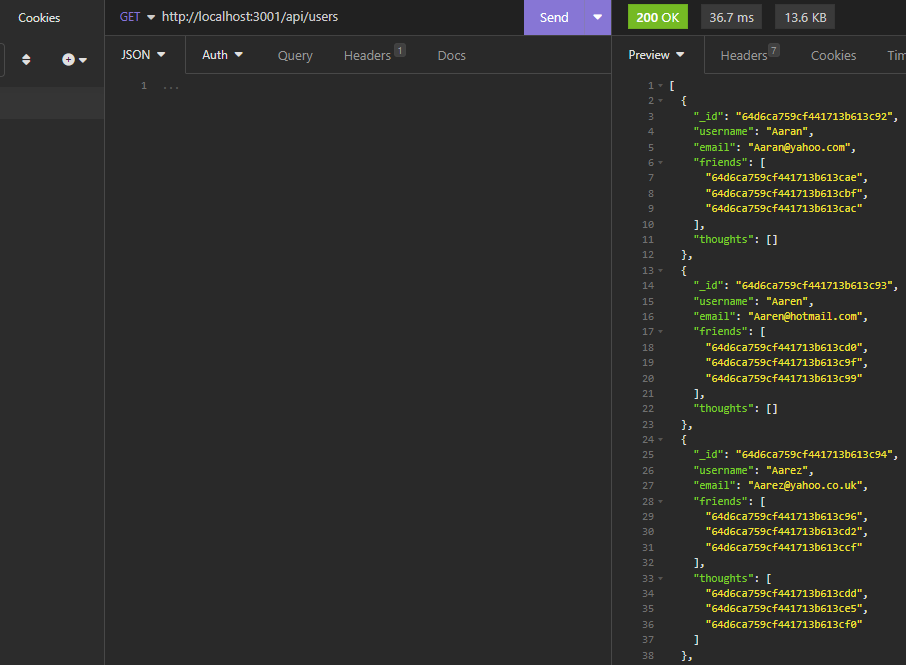

- Get one single user:\
  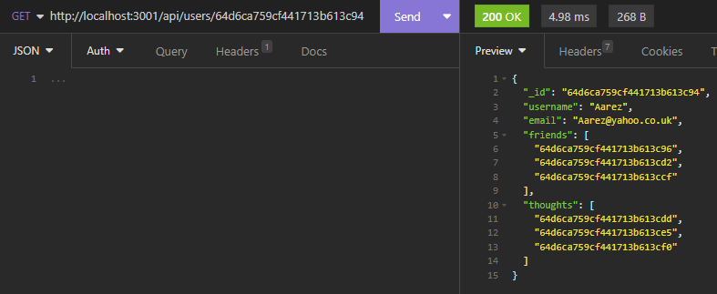

- Post:\
  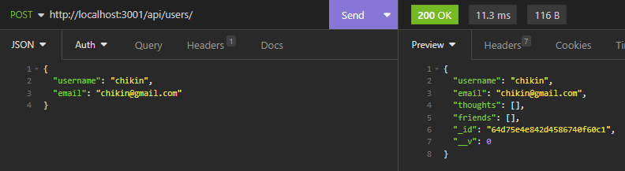

- Update:\
  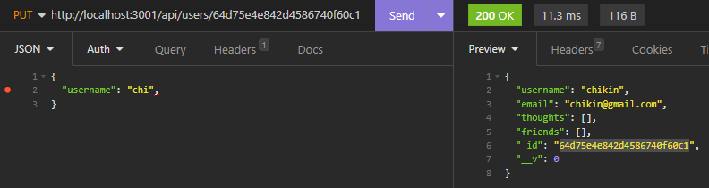
  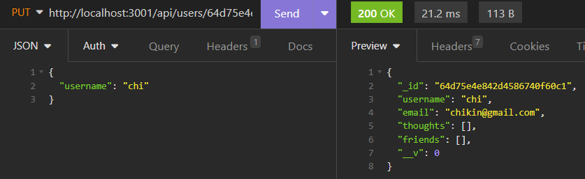

- Delete:\
  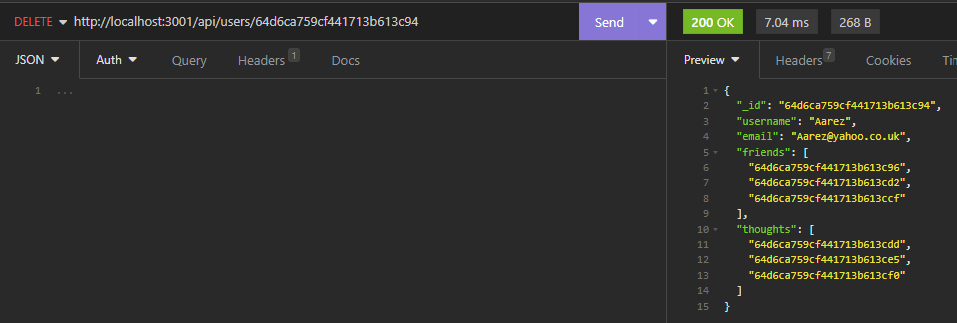
  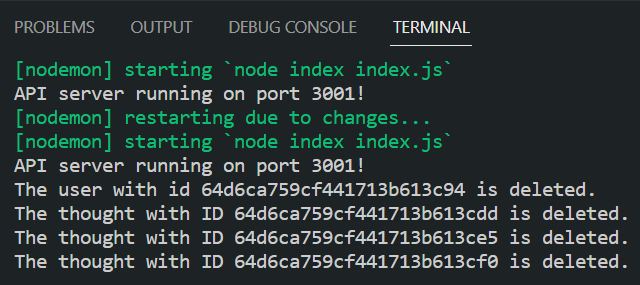

- Add a friend:\
  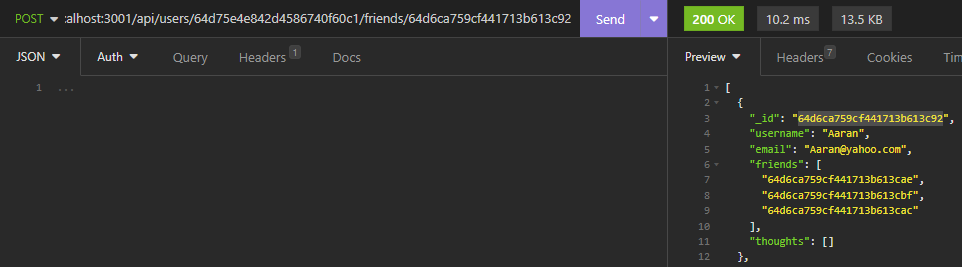
  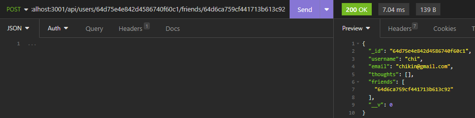

- Delete a friend\
  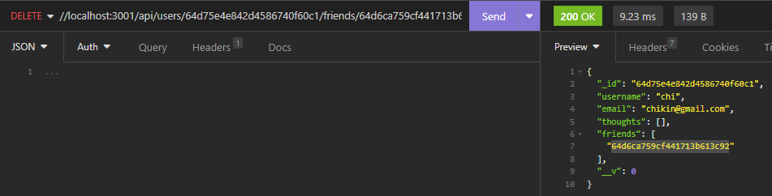
  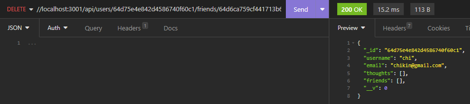

## Thought api

- Get method:\
  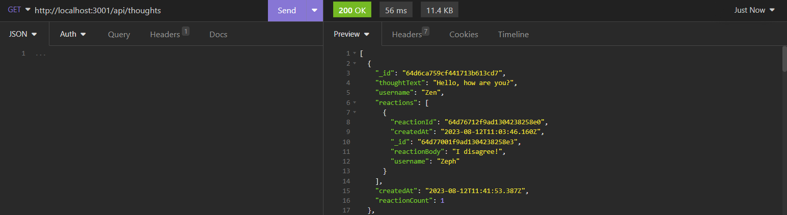

- Get one single thought:\
  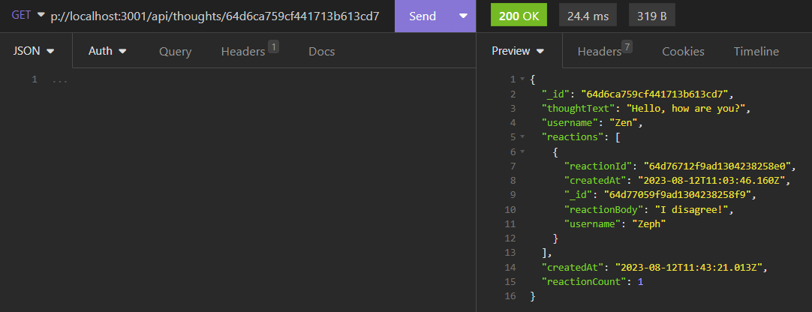

- Post:\
  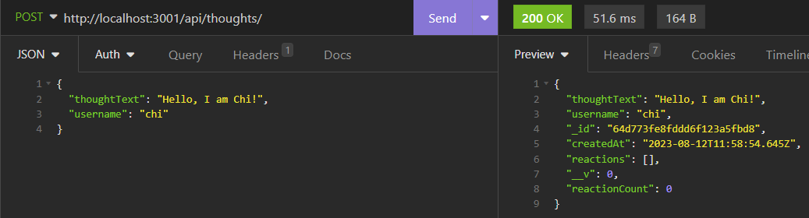

- Update:\
  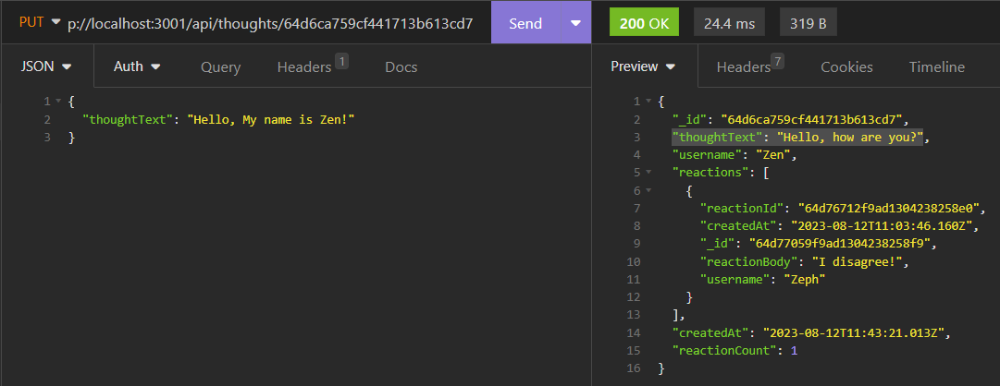
  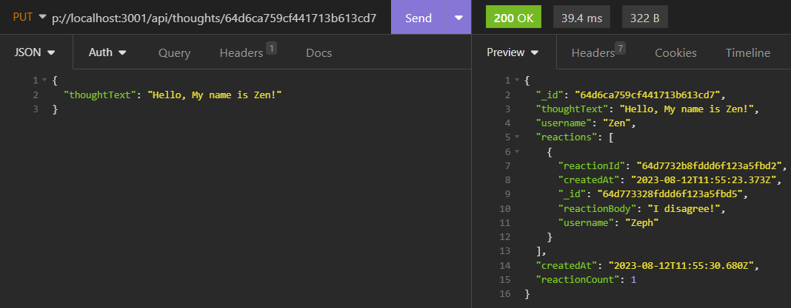

- Delete:\
  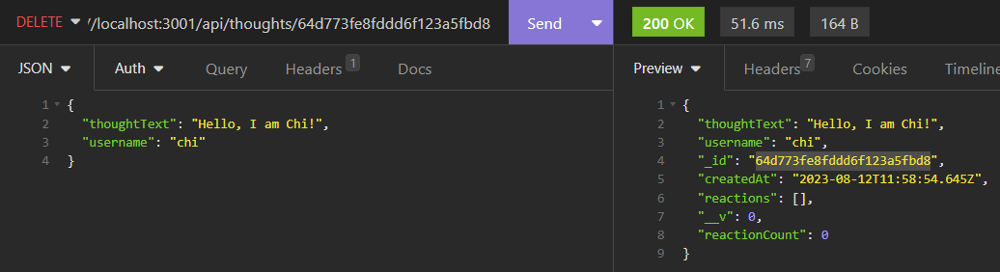
  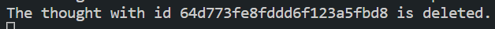

- Add a reaction:\
  
  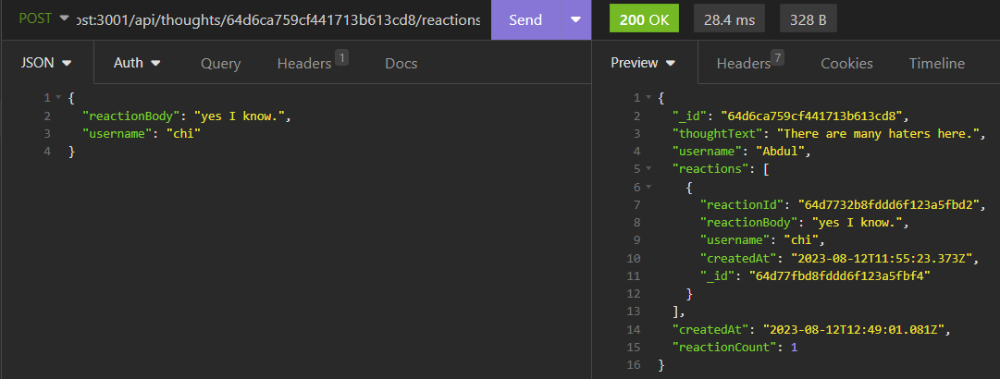

- Delete a reaction\
  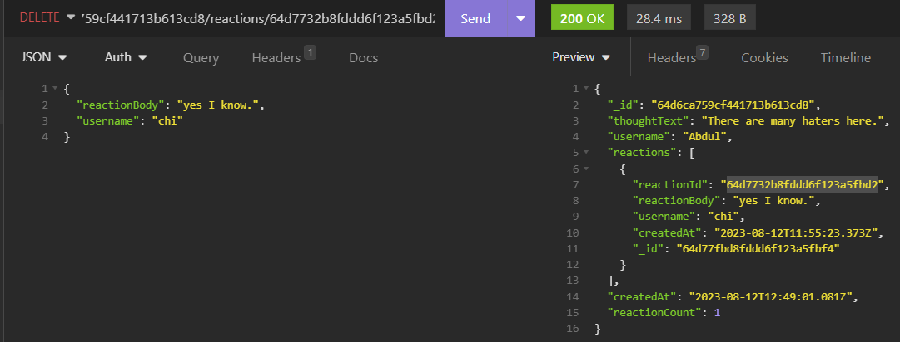
  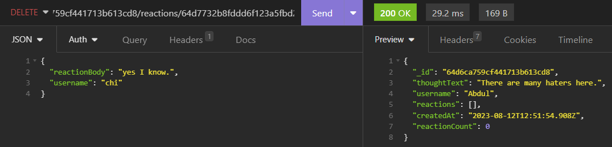

## Extra

- The 'createdAt' in Thought API is now re-format into the form 'On Date, at Time' using a getter:\
  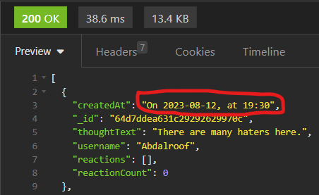
- When a user is deleted, all their thoughts are also deleted.

## Deployment

The link is: [Social-Network-API](https://github.com/cckinwest/Week18-SocialNetworkAPI)

The demo is: [Demo](https://drive.google.com/file/d/1op_N2bFtm_50NPZLAJE0l1DvTpp5bxzh/view)
